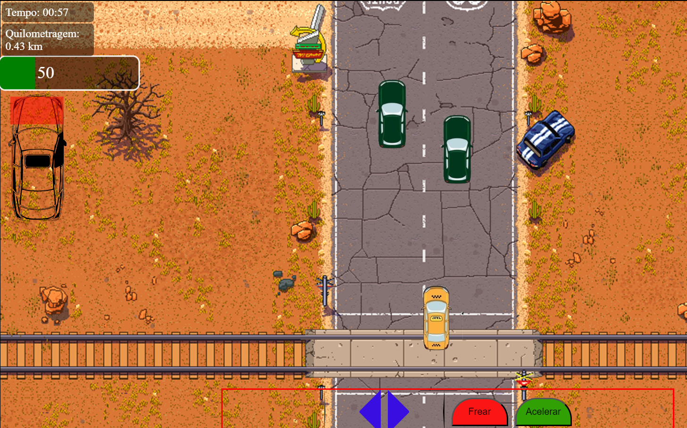

# Jogo de Corrida Sprite
## Descrição
Este repositório contém um projeto de jogo de corrida embrionário desenvolvido como parte de um exercício para treinar técnicas avançadas de manipulação do DOM e uso eficiente de imagens sprite em um contexto de desenvolvimento web. O jogo utiliza uma série de técnicas modernas de JavaScript e CSS para criar uma experiência interativa baseada em sprites animados.

## Tecnologias Utilizadas
- HTML5: Estrutura base do jogo.
- CSS3: Estilização e animações dos sprites.
- JavaScript: Lógica de jogo, manipulação do DOM e modularização com classes.
## Características
O projeto foca no uso de imagens sprite para a animação de elementos do jogo. Além disso, é feito uso intensivo do DOM para criar interações dinâmicas, como a detecção de colisões e a atualização de estados do jogo.

Uso de Classes para Modularização
O código é organizado em várias classes para encapsular diferentes aspectos do jogo:

- Carro: Classe que gerencia o carro do jogador, incluindo seus movimentos e interações.
- Cenario: Classe responsável por controlar o cenário, fazendo com que pareça que o carro está se movendo.
- Controles: Classe que gerencia os controles do jogo, incluindo aceleração, frenagem e movimentação lateral.
- MostradorDeTempo: Classe que gerencia a exibição do tempo e da quilometragem percorrida no jogo.
## Funcionalidades de Interatividade
O jogo implementa funcionalidades interativas avançadas, como:

- Detecção de Colisões: Uso de getBoundingClientRect() para detectar interações entre o carro do jogador e os limites da estrada.
- Controle de Animação: Manipulação de posições de fundo para animar o cenário e dar a impressão de movimento.
- Ajuste Dinâmico de Configurações: Utilização de elementos de interface para ajustar configurações do jogo em tempo real.
- Mostrador de Velocidade e Quilometragem: Exibição da velocidade atual e da quilometragem percorrida com base na velocidade e no tempo de jogo.

Como Executar
Para executar o jogo, clone o repositório e abra o arquivo index.html em um navegador moderno que suporte JavaScript e HTML5.

```
git clone https://github.com/faustinopsy/fast-gear.git
cd fast-gear
open index.html 
```
ou use seu navegador para abrir o arquivo
Contribuições
Contribuições são bem-vindas, especialmente na expansão das funcionalidades do jogo, melhorias na lógica de colisão, ou na otimização das animações dos sprites.

Screenshots
